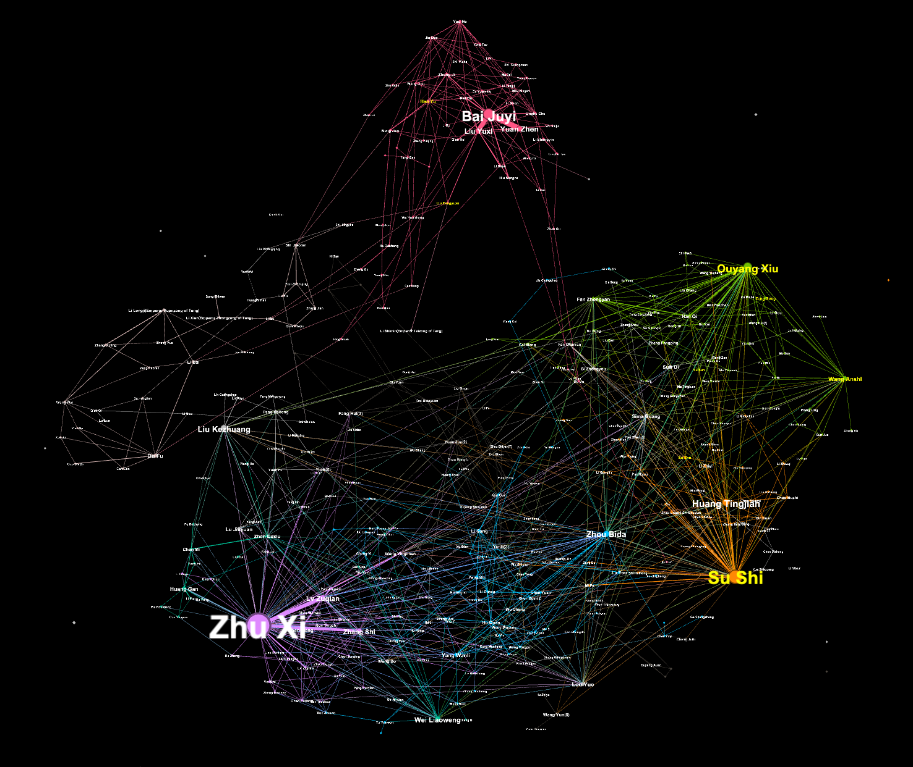

# Gephi: Visualization of the Social Network of the Eight Masters of the Tang and Song (唐宋八大家)

## Project Description
This project was originally assigned as an individual project of the course MFIN7033 Advanced Financial Programming and Databases in the Master of Finance in Financial Technology program at HKU. The author (which is me), in the course of conducting the assignment, found the China Biographical Database (CBDB) quite valuable and would like to draw some attention to it by sharing my work here.

The project was completed in December 2021.  In **January 2022**, a new version of CBDB was released. The **Project Details** section below are based on the **May 2021** version. If you want to replicate the project, please use the latest version.

### Objective of the Project
To use Gephi to visualize the social network of the Eight Masters of the Tang and Song (唐宋八大家).

### Introduction of the Eight Masters of the Tang and Song
To be precise, it should be the Eight **_Great Prose Masters_** of the Tang and Song, which means the title was granted for the excellence in **prose writing**. According to [Wikipedia](https://en.wikipedia.org/wiki/Eight_Masters_of_the_Tang_and_Song), the Eight includes:
- Han Yu 韩愈 (768–824)
- Liu Zongyuan 柳宗元 (773–819)
- Ouyang Xiu 欧阳修 (1007–1072)
- Su Xun 苏洵 (1009–1066)
- Su Shi 苏轼 (1037–1101)
- Su Zhe 苏辙 (1039–1112)
- Wang Anshi 王安石 (1021–1086)
- Zeng Gong 曾巩 (1019–1083)

### Introduction of CBDB and Gephi
#### CBDB
According to the [official website of CBDB](https://projects.iq.harvard.edu/cbdb/home), it is jointly developed by:
- Fairbank Center for Chinese Studies at Harvard University (哈佛大学费正清中国研究中心)
- Institute of History and Philology of Academia Sinica (中研院历史语言研究所)
- Center for Research on Ancient Chinese History at Peking University (北京大学中国古代史研究中心)
The database provides biographical information about
> Approximately **515,488 individuals as of December 2021**, primarily from the 7th through 19th centuries.
More importantly, it is available **free of charge, without restriction, and for academic use**. 

You can download the CBDB standalone database to your local computer or access the database online.
- [CBDB 20220127 version](https://projects.iq.harvard.edu/cbdb/download-cbdb-standalone-database)
- [Access online](https://projects.iq.harvard.edu/cbdb/accessing-cbdb-online)

For Mac users, only SQLite format is available. Hence, they do not enjoy the benefit of the CBDB Access Query System but have to know how to use SQL instead. Unfortunately, I am not an expert of SQL. Even though I would like to provide some query codes, I am not able to accomplish that right now. Nonetheless, I will try to do so in the future.

In terms of how to use the database, please refer to the latest user guide:
- [CBDB Users Guide 20210526](https://projects.iq.harvard.edu/files/chinesecbdb/files/cbdb_users_guide.pdf) (also can be found in the repository)
- [Chinese Version of the Users Guide 2021](https://projects.iq.harvard.edu/files/cbdb/files/cbdb_users_guide_ch_20210322.pdf)

#### Gephi
According to the [official website of Gephi](https://gephi.org),

>Gephi is the leading visualization and exploration software for all kinds of graphs and networks. Gephi is **open-source and free**.

You can download Gephi from their website. There is also a [quick start tutorial](https://gephi.org/users/quick-start/) available.

## Project Details
The following steps show how to get the output network image below.
### 1. Download CBDB Standalone Database, open it in Microsoft Access, and use the querying interface **LookAtNetworks** to get the data.
    
#### Import people
Before import people, you need to create a text file in ANSI format containing only person IDs. To get the IDs, you can use **LookAtEntry** query in the CBDB Access Query System. For Mac users, you can use my sample SQL code below:

```
select * from BIOG_MAIN 
where c_name like 'su shi';
```

The SQL query codes for the Eight are stored in SQL codes for querying person id.sqlite.

#### Query criteria
- Dynasties: from Sui to Yuan
- Max Node Distance: 2
- Max Loop: 10
- Include Kin: YES
- Include Person ID: YES
- Remove 0-degree: YES

### After the query, further filter out relationships with less than 3 interactions (labeled as 'Count').

### Export the query results and clean it with the python codes in Data Cleaning Codes.py.
Sample codes are shown below. Note that:
- Input: query results.xlsx
- Output: the_eight_gephi.xlsx

```
import pandas as pd
import os
 
path = '<Your directory path>'

raw = pd.read_excel(path + os.sep + 'query results.xlsx')

nodes = pd.DataFrame()
linked = pd.DataFrame() # Dataset is pairwise so need to record source and target separately
edge = pd.DataFrame()

# Select data to nodes
# Add index person to nodes
nodes[['Id','Label','姓名','Index Year','Dynasty','Index Place']] = raw[['PersonID','Name','姓名','Index Year','Dynasty','Index Place']]

# Add linked person to nodes
linked[['Id','Label','姓名','Index Year','Dynasty','Index Place']] = raw[['NodeID','Linked to','社會關係人姓名',"Node's Index Year",'Node Dynasty','Node Index Place']]

# Merge two df
nodes = pd.concat([nodes,linked])

# Remove duplicates
nodes = nodes.drop_duplicates()

# Set Id as index
nodes = nodes.set_index('Id')

# Mark the eight masters of the Tang and Song
Eight = ['Su Shi','Liu Zongyuan','Han Yu','Ouyang Xiu','Su Xun','Su Zhe','Wang Anshi','Zeng Gong']
nodes['The Eight'] = nodes['Label'].apply(lambda x: x in Eight)

# Select data to edge
edge[['Source','Target','Weight','Edge Dist.','Distance 距離']] = raw[['PersonID','NodeID','Count','Edge Dist.','Distance 距離']]

# Set Source as index
edge = edge.set_index('Source')

# Export tables
writer = pd.ExcelWriter(path + os.sep + 'the_eight_gephi.xlsx', engine = 'xlsxwriter')
nodes.to_excel(writer, sheet_name = 'nodes_table')
edge.to_excel(writer, sheet_name = 'edges_table')

writer.save()
```
### Import the two worksheets to Gephi and start playing around with it!

## Outcome
After visualizing the social network, Zhu Xi popped up to be an eminent tycoon in the history that was closed related to the Eight either directly and indirectly. Also, Su Shi was another popular figure. The image below shows the network.

